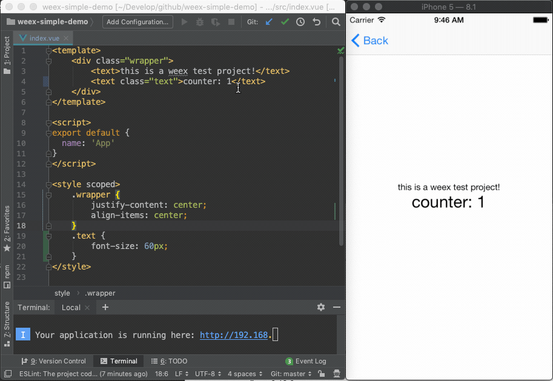
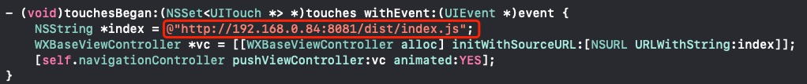

# Introduction

An iOS library for hot reload when the weex bundle changed in development.[Go to see the android version](https://github.com/dearwayne/weex-hot-reload-android) 

# Requires

ios sdk >= 7.0

# Third sdk dependencies

weex_sdk >= 0.18.0

# Usage

add the dependencies to the Podfile

```
pod 'WeexHotReload',:git=>'https://github.com/dearwayne/weex-hot-reload-ios.git',:configurations => ['Debug']
```

# Test

1. clone and run the [weex simple demo](https://github.com/dearwayne/weex-simple-demo)

	```
	$ npm install -g weex-toolkit
	$ git clone https://github.com/dearwayne/weex-simple-demo.git
	$ cd weex-simple-demo
	$ npm install && npm start
	```
	
2. clone this project

	```
	git clone https://github.com/dearwayne/weex-hot-reload-ios.git 
	cd weex-hot-reload-ios
	pod install
	```
	
3. open the project and modify the weex bundle url in HRViewController.m

	
	
4. run the project

5. make some changes in weex simple demo
